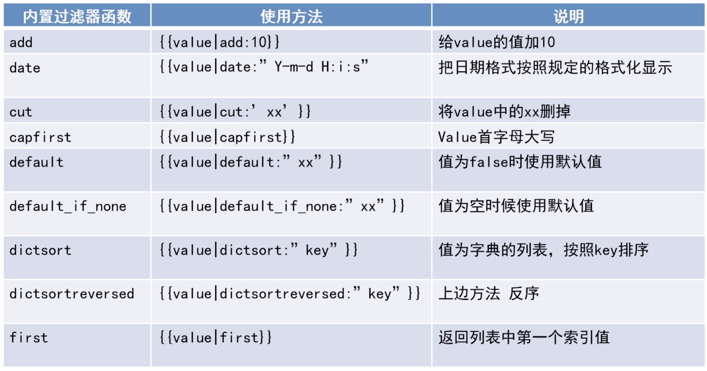
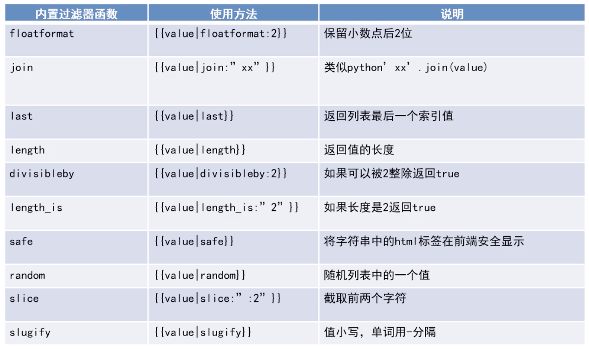

# Python Review
Py复习 Django真香

## 基本语法
- format
```python 
text = '{name} read {book}'.format(name='dollar',book='Py')

text = '{},ok ?'.format('ppp') 
```
- print
```python 
print('a',end=' | ') // end 结尾符
```
- 原始字符串
```python 
r"Newlines are indicated by \n"
```
- 显式行连接
```python
s = 'This is a string.\
This continues the string.'
print(s)
```
输出
```
This is a string.This continues the string.
```
### 项目结构
- 包
- 模块 (py 模块及类)
- 类
    * 函数,变量
包导入的顶级包 是与main执行文件所目录相关

### os
```python
def test1():
    inp = input("输入ppc:")
    f = open('cos.txt', 'w') # w写 r读 a追加
    f.write(inp)
    f.close()


def test2():
    f = open('cos.txt', 'r')
    a = f.read()  # 读全部
    print(a)


def test3():
    f = open('cos.txt','r')
    while True:
        line = f.readline() # 按行读
        if len(line) == 0:
            break
        print(line,end=' ')


if __name__ == '__main__':
    # test1()
    # test2()
    test3()
```

### 异常
```python
def test_err():
    raise Exception('error') # 抛出异常


if __name__ == '__main__':
    try:
        test_err()
    except Exception:
        print(Exception)
    finally:
        print("end")
```

### 函数式编程
- lambda 表达式
```python
f = lambda x,y: x + y
f(1,2)
```
- 三元表达式
```python 
# true if 条件 else false
return x if x > y else y
```

### 装饰器
```python
# 定义装饰器
def decorator(func):
    def wrapper(*args,**kw):
        print(time.time())
        func(*args,**kw)

    return wrapper

@decorator
def f1(name):
    print('this is a function',name)

if __name__ == '__main__':
    f1("sd")
```
class 装饰器
```python
class ms:
    @staticmethod
    def test(name):
        def decorator(func):
            print("=============")
            return func

        return decorator

@ms.test('name') # 默认会执行
def f2():
    print("this is f2")
```
class 装饰器2
```python 
class Concurrent:
    @staticmethod
    def sync():
        def decorator(func):
            def war(*args, **kw):
                print("hello")
                func(*args, **kw)

            return war

        return decorator


# 下面是test
@Concurrent.sync()
def f1(name):
    print(name)


if __name__ == '__main__':
    '''
    this is test
    '''
    f1("hello")
```


### Py3.6 协程
https://www.cnblogs.com/hello-init/p/10375063.html

### 开始Django学习
- 基础 Django View Url Template ORM
- 扩展 Sqlalchemy Redis Mongodb Jinja2 Mako

### PipEnv
```bash 
pip3 install pipenv
pipenv install  # 带当前目录创建虚拟环境
pipenv shell    # 进入虚拟化环境
exit            # 退出虚拟环境
pipenv install  package   # 安装包
pipenv uninstall package  # 卸载包
pipenv graph    # 环境依赖
```
清华大学PIP源：https://pypi.tuna.tsinghua.edu.cn/simple/
### Django基础命令
- django-admin startproject 项目名称 -> 创建一个django项目
- python manage.py startapp 应用名 -> 项目中创建一个应用
- python manage.py shell -> 进入调试模式
- python manage.py makemigrations -> 数据库创建更改文件
- python manage.py migrate -> 同步到数据库进行更新
- python manage.py flush -> 清空数据库
- python manage.py runserver 0.0.000.0:8000 -> 启动开发服务器
- python manage.py 查看更多命令

### 基础入门
```bash 
pip3 install django
django-admin createproject project_name
cd project_name
django createapp app
django runserver
```
- app/views.py
```python 
from django.http import HttpResponse
def hello(request):
    return HttpResponse("Hello")
```
- `touch app/urls.py`
```python 
from django.conf.urls import url
from .view import hello
urlpatterns = [
    url('',hello)
]
```
- project_name/urls.py
```python 
from django.contrib import admin
from django.urls import path, include

from app import urls as app_urls

urlpatterns = [
    path('admin/', admin.site.urls),
    path('app/', include(app_urls))
]
```
## 参数获取
### Url参数获取
- 以?形式
```python 
request.GET.get(参数名称)
```
- 以分隔符信息
``` python
def index(request,参数名,参数名):
    print(参数名)
#   path('he/<str:name>/<int:age>',ppc)
```
- 获取POST类容
```python 
request.POST
```
- 获取path路径
```python 
request.path
```
- 获取请求方法
```python 
request.method
```
- 获取请求cookie
``` 
request.COOKIES
```
- 请求用户对象
``` 
request.user
```
- 获取session
``` 
request.session
```
- 获取meta
``` 
request.META
```
### 常用返回对象
- HttpResponse 可以直接返回一些字符串内容
- render 将数据在模板中渲染并显示
- JsonResponse 返回一个json类型
``` python
from django.http import HttpResponse
from django.http.shortcuts import render
from django.http impor JsonResponse
```
### 视图面向对象的写法
```python 
from django.views.generic import View
Class Test(View):
    def get(self,request):
        return xxx
# path('',Test.as_view())   调用
```

### Http常用返回状态码
- 200 ok
- 400 请求错误
- 401 未授权
- 403 权限不够
- 405 方法禁用
- 500 Server Error

### Template 配置方法
```python
from django.shortcuts import render
from django.views.generic import View

class Index(View):
    TEMPLATE = 'index.html'
    def get(selef,request,name):
        return render(request,Index.TEMPLATE,{"name":name})
```
- 模板标签
```python
                 遍历输出内容
         对遍历进行条件判断
                   对遍历进行条件判断

                            加载django的标签库 


              读取静态资源
           模板继承

        重写父模板的代码
                      跨域的秘钥
```
- for标签模板
```python
forloop.counter      重1开始计算获取当前索引
forloopcounter()     从0开始计算获取当前索引
forloop.revcounter   索引从最大数递减到
forloop.revcounter() 索引从最大数递减到0
forloop.first        当前元素是否是第一个
forloop.last         当前元素是否是最后一个
empty                为空的情况
```
- 静态文件配置
    - 项目根目录创建 'static' 与 'templates'
    - `STATICFILES_DIRS=(os.path.join(BASE_DIR,'static'),)`

- 演示
```html
  // 加载静态文件东西

 
        <li>{{item}} ------- {{forloop.counter}}   -------    {{forloop.counter}}   ----  {{forloop.revcounter}}</li>
        
               // 如果是第一个
            this is first 
              // 如果是第最后一个
            this is last
        

                          // 如果是空
        this is empty
        

    <a href="">return</a>              // url映射
    <link rel="stylesheet" href=""/>  // 映射静态资源地址
```
- 模板继承相关
```html
<head>
    
    <meta charset="UTF-8">
    <meta name="viewport" content="width=device-width, initial-scale=1.0">
    <meta http-equiv="X-UA-Compatible" content="ie=edge">
    <title>模板继承相关   </title>
        <!-- css相关定义 -->
        
        
    
</head>
<body>
    
    

    
    
</body>
```

```html

<!-- 引用basehtml -->

<!-- 加载静态文件标签 -->

<!-- 重写css style -->

    <link rel="stylesheet" href="" />



    这个重写 base中的内容


# 注意这里是追加 不是重写 (⊙o⊙)…
```

### 内置过滤器
常用过滤器:


自定义过滤器:
- 在应用下创建templatetags文件夹
- 在文件夹下创建myfilter.py
```python
from django import template
register = template.Library() # 定义过滤器

@register.filter
def test_filter(value,args):
    """
    value 传过来的值
    aargs 参数
    """
    return value + args

# 使用  方法添加了要重启才会被识别

{{data|test_filter:3}}
```

### DjangoModel
- 在settings.py 中配置数据库信息
- 在应用app的models.py中以类的形式定义模型
```python
DATABASES = {
    'default': {
        'ENGINE': 'django.db.backends.mysql',           # 数据库引擎
        'NAME': 'djangotest',                           # 数据库名称
        'USER': 'root',                                 # 数据库用户名
        'PASSWORD': '123456',                           # 数据库密码
        'HOST': '127.0.0.1',                            # 数据库地址 默认localhost
        'PORT': '3306',                                 # 数据库端口
    }
}
```
生成模型
```python
python manage.py makemigrateions  # 在migrate文件夹下生成initialpy脚本文件
python manage.py migrate          # 将initialpy脚本中的代码执行，生成相对应的数据表
```